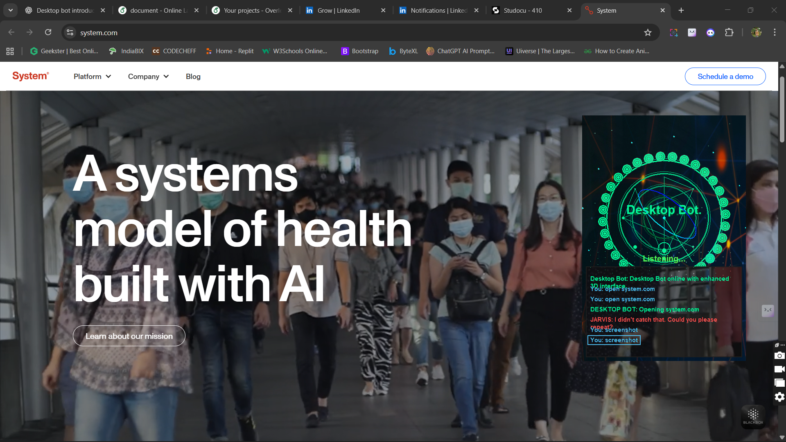

# 🤖 Desktop Bot AI Assistant

A sophisticated voice-controlled desktop assistant with a stunning 3D holographic interface, powered by Google Generative AI and advanced computer graphics.



## ✨ Features

- 🎙️ **Voice Recognition**: Natural language voice commands
- 🎨 **3D HUD Interface**: JARVIS-like holographic display with OpenGL
- 🤖 **AI Conversations**: Powered by Google Gemini AI
- 📁 **File Management**: Voice-controlled file explorer
- 🌐 **Web Integration**: Search engines, YouTube, news
- 🔊 **Text-to-Speech**: Natural voice responses
- 👁️ **Auto-Hide**: Non-intrusive, hides when other apps are active
- 💬 **Chat History**: Persistent conversation storage

## 🚀 Quick Start

### Prerequisites
- Python 3.8+
- Windows OS
- Microphone access
- Internet connection

### Installation

1. **Clone the repository**
   ```bash
   git clone https://github.com/yourusername/desktop-bot-ai.git
   cd desktop-bot-ai
   ```

2. **Install dependencies**
   ```bash
   pip install -r requirements.txt
   ```

3. **Set up Google AI API**
   - Get API key from [Google AI Studio](https://makersuite.google.com/)
   - Add your API key to the code (see Configuration section)

4. **Run the application**
   ```bash
   python app.py
   ```

## 🎯 Usage

### Voice Commands
- **"Hello"** - Activate the assistant
- **"Search for [query]"** - Web search
- **"Play [song name]"** - YouTube music
- **"Open downloads"** - File explorer
- **"What's the weather?"** - AI-powered responses
- **"Exit"** - Close application

### GUI Controls
- Click the 3D interface to interact
- Use the chat input for text commands
- File explorer button for GUI file management

## 🛠️ Technologies

| Component | Technology | Purpose |
|-----------|------------|---------|
| **Graphics** | OpenGL, Pygame | 3D rendering and animation |
| **AI** | Google Generative AI | Conversational intelligence |
| **Voice** | SpeechRecognition, pyttsx3 | Voice I/O processing |
| **GUI** | Tkinter | User interface framework |
| **System** | pywin32, psutil | Windows integration |

## 📁 Project Structure

```
desktop-bot-ai/
├── app.py                    # Main application entry point
├── launch_3d_interface.py    # 3D HUD interface controller
├── background_manager.py     # Background image management
├── effects.py               # Visual effects and animations
├── requirements.txt         # Python dependencies
├── PROJECT_THEORY.md        # Detailed technical documentation
├── assets/                  # Images and resources
│   └── background.jpg
└── cache/                   # Temporary files
```

## ⚙️ Configuration

### Google AI API Setup
1. Visit [Google AI Studio](https://makersuite.google.com/)
2. Create a new API key
3. Replace `YOUR_API_KEY` in the code with your actual key

### Voice Settings
- Adjust microphone sensitivity in `listen_for_commands()`
- Modify TTS voice properties in the initialization section

## 🎨 3D Interface Details

The holographic interface features:
- **Concentric Circles**: Rotating 3D rings with depth-based coloring
- **Neural Network Nodes**: Animated connection points
- **Energy Fields**: Dynamic particle effects
- **Voice Visualization**: Real-time audio wave display
- **Status Indicators**: Command feedback and system status

## 🔧 Development

### Adding New Commands
1. Extend the `process_command()` function
2. Add voice recognition patterns
3. Implement the command logic
4. Update the help documentation

### Customizing the 3D Interface
- Modify `Advanced3DAnimation` class for visual changes
- Adjust colors, speeds, and effects in the rendering loop
- Add new 3D elements in the `Circle3D` class

## 📊 Performance

- **Memory Usage**: ~50-100MB
- **CPU Usage**: 5-15% (idle), 20-40% (active)
- **Response Time**: <2 seconds for most commands
- **Voice Recognition**: 95%+ accuracy in quiet environments

## 🤝 Contributing

1. Fork the repository
2. Create a feature branch (`git checkout -b feature/amazing-feature`)
3. Commit your changes (`git commit -m 'Add amazing feature'`)
4. Push to the branch (`git push origin feature/amazing-feature`)
5. Open a Pull Request


## 🙏 Acknowledgments

- Google AI for the Generative AI API
- OpenGL community for graphics libraries
- Python speech recognition contributors

